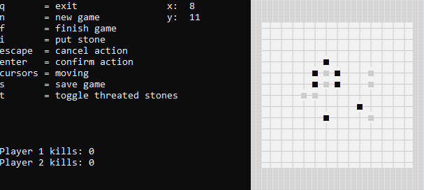

# Go Game



## Overview
This is a console-based implementation of the board game **Go**. The game allows players to compete against each other, place stones, capture opponent stones, and calculate scores based on the traditional rules of Go. The game also supports handicap stones, the ability to save and load game states, and dynamic board resizing.

## Features
- Supports two-player Go gameplay.
- Implements rules for capturing stones, *Ko*, and *handicap*.
- Supports different board sizes.
- Allows saving and loading games.
- Displays board displacement for larger boards that do not fit the screen.
- Provides visual indicators for stones with one liberty left.

## Installation
1. Clone the repository:
   ```sh
   git clone https://github.com/AdrianSzwaczyk/go-game.git
   ```
2. Compile the game using a C++ compiler (it's the easiest to just open VS solution and compile it).

3. Run the game.

## How to Play
Controls are displayed when playing. For game rules check Wikipedia or something like that.
